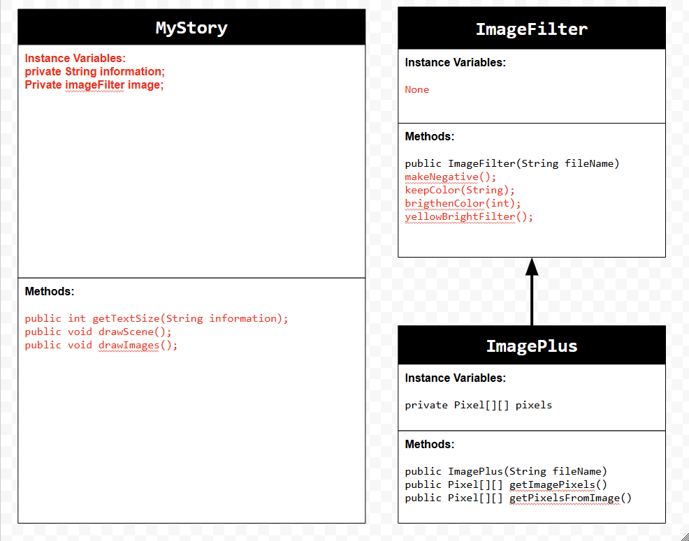

# Unit 4 - Personal Narrative

## Introduction

Images are often used to portray our personal experiences and interests. We also use image filters and effects to change or enhance the mood of an image. When combined into collages and presentations, these images tell a story about who we are and what is important to us. Your goal is to create a personal narrative using The Theater that consists of images of your personal experiences and/or interests, incorporates data related to these experiences and/or interests that can be organized in a 2D array, and uses image filters and effects to change or enhance the mood of your images.

## Requirements

Use your knowledge of object-oriented programming, two-dimensional (2D) arrays, and algorithms to create your personal narrative collage or animation:

- **Create at least two 2D arrays** – Create at least two 2D arrays to store the data that will make up your visualization.
- **Implement one or more algorithms** – Implement one or more algorithms that use loops and two-way or multi-selection statements with compound Boolean expressions to analyze the data.
- **Use Image Filters** - Include multiple image filters learned from this unit, and additionally create new ones of your own.
- **Use methods in the String class** – Use one or more methods in the String class in your program, such as to determine whether the name of an image file contains specific characters.
- **Create a visualization** – Create an image or animation that conveys the story of the data by illustrating the patterns or relationships in the data.
- **Document your code** – Use comments to explain the purpose of the methods and code segments and note any preconditions and postconditions.

## UML Diagram

Put and image of your UML Diagram here. Upload the image of your UML Diagram to your repository, then use the Markdown syntax to insert your image here. Make sure your image file name is one work, otherwise it might not properly get display on this README.

## Video

Record a short video of your story to display here on your README. You can do this by:

- Screen record your project running on Code.org.
- Upload that recording to YouTube.
- Take a thumbnail for your image.
- Upload the thumbnail image to your repo.
- Use the following markdown

[https://www.youtube.com/shorts/dFyyyUv8GIA]

## Story Description

Write a description of the story that your animation showcases. Give addional context for your story here in the case your animation is more abstract and only has images and little text. Lastly, include what data in your project is represented in 2D arrays and how those directly relate to the story your animation showcase.

In my animation, the story that is being showcased is a game between Barcelona and Madrid. The reason why I decided to do my animation like this is because I really like soccer and I thought it would be a great Idea to create a game you can watch. I added lots of images and text so you and anybody else is able to understand what is happening. The data in my project that is being represented in 2D arrays are the images and text. I am able to utilize these by getting each index, sadly I couldnt use a for loop because when I tried, the images and text started to go in the wrong order.
## Image Filter Analysis

Choose at least 2 filters uses in your animation to explain how the pixels are modified. If you created a new image filter that was not one of the ones from this unit, make sure to explain and analyze that filter(s) before choosing ones that came from this unit.

2 filters that I incorporated in my animation was the makeNegative and yellowBrightFilter. One of them was taken from a previous lesson, and another was one I made by myself. In the yellowBrightFilter, each pixel is grabbed by a method and passed through a row major traversal for loop. It then gets modifed by keeping the green, and adding 255 to the red an blue. This makes the color of the image a really bright yellow color. In the makeNegative filter, the pixels are being grabbed individually from the getPixelsfromImage method. After, the for loops goes through each row and column to get each pixel and modify it. It subtracts 255 from the currentPixel red, green, and blue. This in the end causes the image to change a lot. These filters change the images and make the animation unique and different. 